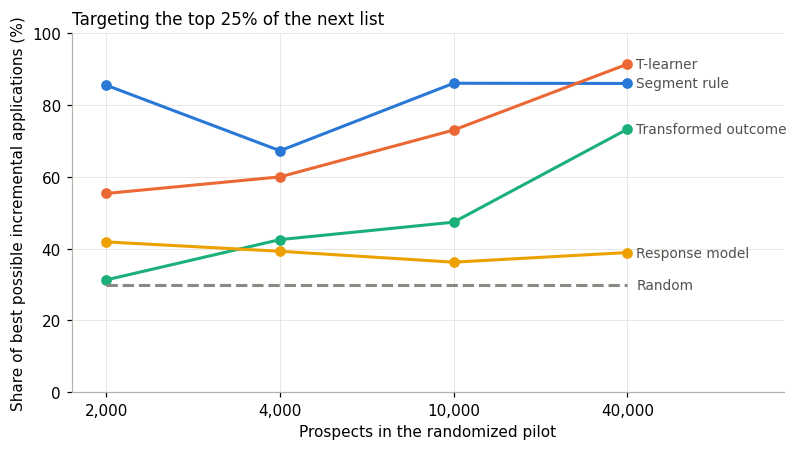
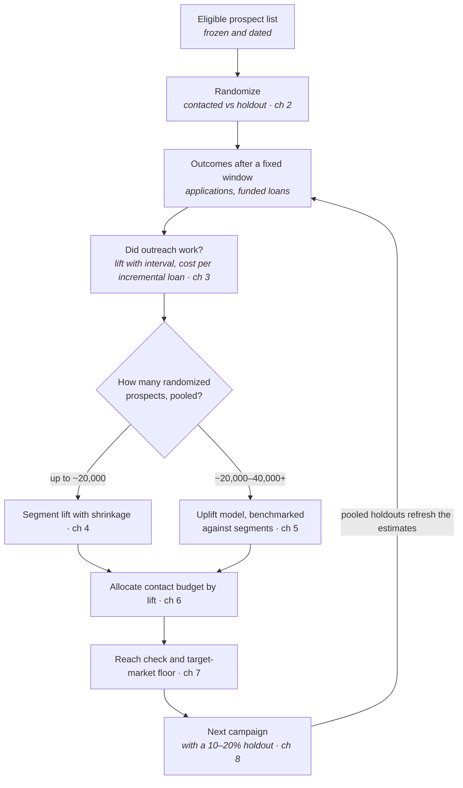

# Causal Uplift Targeting Guide

**Reach the businesses your outreach actually helps. A practical guide for community lenders (CDFIs, community
development credit unions, community banks, and nonprofit loan funds) to measure and target the incremental effect of
outreach with a limited budget.**

Most outreach goes to the people most likely to respond. Many of them would have applied anyway. This guide shows how
to find out what outreach really changes, and for whom, using methods that work at the scale of a small lender: a few
thousand prospects, a few loan officers, and a spreadsheet.



*From the worked example (synthetic data): targeting the top 25% of a list. A conventional response model captures about
40% of the achievable gain, however much data it has. A segment table from a randomized pilot captures most of it from
the smallest pilot. Individual uplift models catch up only at tens of thousands of prospects.*

---

## What is different about this guide

**1. It starts from a randomized test, not from a model.** Open-source uplift libraries assume you already have large
randomized datasets. Most community lenders have never run a controlled outreach test. The guide shows how to design
one in a spreadsheet, how large it must be, and how to keep it fair to the people held out
([chapter 2](guide/02-designing-the-test.md)).

**2. It is sized for small lenders, and says when *not* to use machine learning.** A simulation in the worked example
shows that below roughly 20,000–40,000 randomized prospects, a handful of well-chosen segments with shrinkage beats
individual uplift models. The guide gives a practical rule for which method fits which volume
([chapters 4–5](guide/05-uplift-models.md)).

**3. It builds in mission and target-market reach.** Targeting changes who hears from a lender. The guide checks each
campaign's reach against the whole list, and supports a floor such as the CDFI 60% target-market benchmark, so
efficiency never quietly erodes mission ([chapter 7](guide/07-mission-reach-and-fair-lending.md)). It also covers the 2026
Regulation B changes relevant to marketing.

**4. It reports honest costs.** It uses cost per *incremental* funded loan, not cost per loan among those contacted. In the
worked example the naive figure is $472 and the honest one $1,729, because 73% of the contacted group's loans would have
happened anyway ([chapter 3](guide/03-measuring-incremental-effect.md)).

## How it fits together



## Contents

| | |
|---|---|
| [**CHECKLIST.md**](CHECKLIST.md) | The whole method on one page |
| [1. Why "who responds" is the wrong question](guide/01-why-response-models-waste-outreach.md) | Sure things, persuadables, and what uplift means |
| [2. Designing the test](guide/02-designing-the-test.md) | Randomizing in a spreadsheet, sample size, holdout ethics |
| [3. Did outreach work at all?](guide/03-measuring-incremental-effect.md) | Lift with intervals; cost per incremental outcome |
| [4. Segment lift](guide/04-segment-lift.md) | The small lender's main tool; shrinkage |
| [5. Uplift models](guide/05-uplift-models.md) | T-learner, transformed outcome, Qini curves, and when models are worth it |
| [6. Choosing who to contact](guide/06-choosing-who-to-contact.md) | Allocating a contact budget |
| [7. Mission, reach, and fair lending](guide/07-mission-reach-and-fair-lending.md) | Reach reports, target-market floors, Regulation B |
| [8. Keep a holdout](guide/08-keep-a-holdout.md) | Pooling, exploration, refreshing, monitoring |
| [9. Other uses](guide/09-other-uses.md) | Payment-assistance outreach, TA referrals, renewals |
| [`templates/`](templates/) | Test plan, campaign results |
| [`spreadsheet/uplift-calculator.xlsx`](spreadsheet/uplift-calculator.xlsx) | Sample size, test result, segment lift, next-campaign allocation (no code needed) |
| [`examples/walkthrough.ipynb`](examples/walkthrough.ipynb) | Worked example on synthetic data |
| [`examples/payment_assistance_walkthrough.ipynb`](examples/payment_assistance_walkthrough.ipynb) | Second worked example: which borrowers a proactive payment-assistance call helps (chapter 9.1) |
| [`examples/uplift_tools.py`](examples/uplift_tools.py) | All methods as plain Python functions |

## Quick start

**No code:** read the [checklist](CHECKLIST.md), then open the [spreadsheet](spreadsheet/uplift-calculator.xlsx) and start
with the "Sample size" tab.

**Python:**

```bash
git clone https://github.com/hannahxuhang-hue/causal-uplift-targeting-guide.git
cd causal-uplift-targeting-guide
pip install -r requirements.txt
cd examples && jupyter notebook walkthrough.ipynb
```

## About the data

All data in this repository is **synthetic**, generated by [`examples/synthetic_data.py`](examples/synthetic_data.py). It
does not describe any real lender, business, or campaign. Because it is simulated, each prospect's true effect of
outreach is known, which lets the worked example check which targeting method *actually* worked. In a real campaign that
is never observable.

## Companion repository

[**Lending Model Monitoring Guide**](https://github.com/hannahxuhang-hue/lending-model-monitoring-guide): monitoring lending
models at small institutions. Uplift targeting models, and the credit models that decide the applications outreach
produces, both belong in its monitoring cycle.

## Scope and disclaimer

This is a personal project, written on personal time. It draws only on published methods and public sources, cited below.
It contains no data, code, results, or documentation from any employer, and it is not affiliated with or endorsed by any
employer or financial institution.

General methodology only. It is **not legal, regulatory, or compliance advice**.

## References

- Athey, S., & Imbens, G. (2016). Recursive partitioning for heterogeneous causal effects. *PNAS*, 113(27), 7353–7360.
- CDFI Fund (2024). *CDFI Certification Application* (revised), target-market requirements.
- Consumer Financial Protection Bureau (2026). *Equal Credit Opportunity Act (Regulation B)*, final rule, April 22, 2026.
- Devriendt, F., Moldovan, D., & Verbeke, W. (2018). A literature survey and experimental evaluation of the state-of-the-art in uplift modeling. *Big Data*, 6(1), 13–41.
- Gutierrez, P., & Gérardy, J.-Y. (2017). Causal inference and uplift modelling: A review of the literature. *Proceedings of Machine Learning Research*, 67, 1–13.
- Jaskowski, M., & Jaroszewicz, S. (2012). Uplift modeling for clinical trial data. *ICML Workshop on Clinical Data Analysis.*
- Kohavi, R., Tang, D., & Xu, Y. (2020). *Trustworthy Online Controlled Experiments.* Cambridge University Press.
- Künzel, S. R., Sekhon, J. S., Bickel, P. J., & Yu, B. (2019). Metalearners for estimating heterogeneous treatment effects using machine learning. *PNAS*, 116(10), 4156–4165.
- Radcliffe, N. J. (2007). Using control groups to target on predicted lift. *Direct Marketing Analytics Journal*, 1, 14–21.

## Feedback and use

If you work at a lender or network and use or adapt this material, or find it doesn't fit how you work, please [share how you used it](https://github.com/hannahxuhang-hue/causal-uplift-targeting-guide/issues/new?template=feedback.yml) or open an issue. See [CONTRIBUTING.md](CONTRIBUTING.md) for other ways to help. Changes made in response to feedback are recorded in [CHANGELOG.md](CHANGELOG.md).

## How to cite

See [`CITATION.cff`](CITATION.cff), or: Xu, H. (2026). *Causal Uplift Targeting Guide* (Version 1.1).
https://github.com/hannahxuhang-hue/causal-uplift-targeting-guide

## License

Guide text, checklist, templates, figures, and spreadsheet: [CC BY 4.0](LICENSE-docs.md). Code: [MIT](LICENSE).

**Author:** Hang (Hannah) Xu
