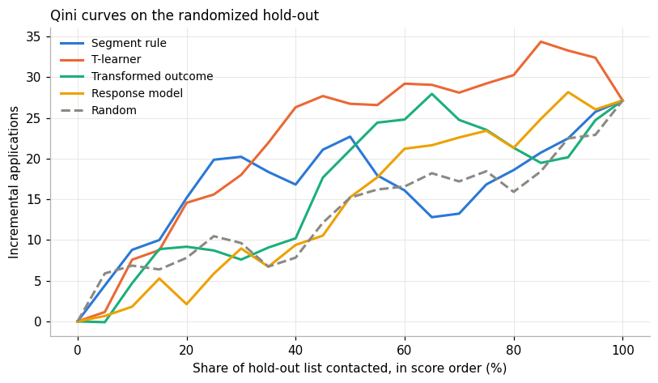

# 5. Uplift models, and when they are worth it

An uplift model predicts, for each individual prospect, how much outreach will change their chance of applying.
It can capture combinations of characteristics that no handful of segments would. It also needs far more data
than most small lenders have.

## 5.1 Three common approaches

All three must be trained on **randomized** data: prospects who were and weren't contacted by chance.

| Approach | How it works | Notes |
|---|---|---|
| **T-learner** (two models) | Fit one model on contacted prospects and one on holdout. Uplift = difference in predicted rates | Simple; works with any classifier. Each model sees only half the data (Künzel et al., 2019) |
| **Transformed outcome** (class transformation) | With a 50/50 split, define Z = 1 if (contacted and applied) or (not contacted and didn't apply). Then uplift = 2·P(Z=1) − 1 | One model. Very noisy at small sizes (Jaskowski & Jaroszewicz, 2012) |
| **Causal trees and forests** | Trees that split directly on differences in lift | Strong with large data (Athey & Imbens, 2016); more machinery than most small lenders need |

For comparison, a **response model** is fitted on contacted prospects only and predicts who applies. It measures the
wrong thing ([chapter 1](01-why-response-models-waste-outreach.md)).

Use only characteristics known **before** outreach. Anything recorded afterwards, such as "opened the mailer", is
partly caused by the outreach and will bias the model.

## 5.2 Evaluating a targeting score: the Qini curve

You cannot check an uplift prediction against any single prospect's true uplift. You evaluate the **ranking** on a
randomized hold-out sample the model never saw:

1. Sort hold-out prospects by score, highest first.
2. For the top *x*%, compute incremental outcomes = (outcomes among contacted) − (outcomes among holdout) × (contacted
   count ÷ holdout count).
3. Plot against *x*. This is the **Qini curve** (Radcliffe, 2007). Random ordering gives a straight line from zero to
   the overall incremental total. A useful score rises well above it early.

The **Qini coefficient** is the area between the curve and the random line. `qini_curve()`, `qini_coefficient()`, and
`policy_value()` implement these.

**Small-sample warning.** In the worked example the hold-out has 1,600 prospects, so the top 25% holds about 200 per
arm. The Qini coefficient there ranked the T-learner above the segment rule, **the opposite of the true result**, which
is known only because the data is simulated. Always report `policy_value()` with its bootstrap interval, and don't
choose between methods whose intervals overlap heavily.

## 5.3 How much data before a model beats a segment table?

The worked example answers this by simulation. Pilots of different sizes were used to train each method, then target
the top 25% of a fresh list. The measure is the share of the **best possible** incremental applications captured
(averaged over three runs):

| Pilot size | Response model | Segment rule | T-learner | Transformed outcome | Random |
|---|---|---|---|---|---|
| 2,000 | 42% | 85% | 55% | 31% | 30% |
| 4,000 | 39% | 67% | 60% | 43% | 30% |
| 10,000 | 36% | 86% | 73% | 47% | 30% |
| 40,000 | 39% | 86% | 91% | 73% | 30% |

Three lessons:

1. **A response model stays near 40% however much data it gets.** More data does not fix a model that measures the
   wrong thing.
2. **A well-chosen segment table does well from the smallest pilot.** The condition matters: the segments here were
   chosen with real knowledge of why prospects apply. Arbitrary segments would do worse.
3. **Individual uplift models only pull ahead at tens of thousands of randomized prospects.** Below that, their extra
   flexibility mostly fits noise.

These figures come from one simulated setting and are not universal constants. The direction is well established in
the uplift literature (see Devriendt et al., 2018; Gutierrez & Gérardy, 2017): uplift signals are small differences
between two noisy rates, and estimating them per individual takes much more data than estimating response.

## 5.4 Practical rule

| Randomized prospects (pooled across campaigns) | Use |
|---|---|
| Under ~1,500 | Overall lift only ([chapter 3](03-measuring-incremental-effect.md)); pool before segmenting |
| ~1,500 to ~20,000 | **Segment table with shrinkage** ([chapter 4](04-segment-lift.md)) |
| Above ~20,000–40,000 | Consider a T-learner or causal forest, **and** keep the segment table as the benchmark it must beat on hold-out data |

## 5.5 If you do build a model

- Fit it on randomized data only.
- Keep a hold-out sample the model never sees, and compare against the segment table on it.
- Use shallow, regularized models (the example uses gradient boosting with depth 3 and at least 40 prospects per leaf).
- Document inputs, training data, hold-out results, and the benchmark comparison, as you would for any lending model.
  The companion [monitoring guide](https://github.com/<your-username>/lending-model-monitoring-guide) covers ongoing
  monitoring.
